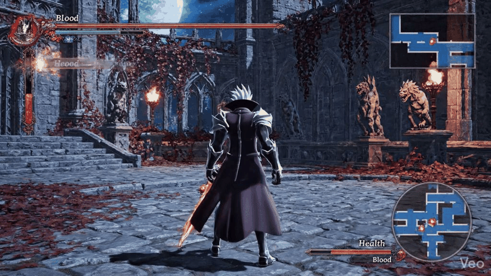

<div align="center">

# 🩸 REVENANT PROTOCOL: SANGUINE ZERO


<br/>


<br/><br/>

> **Designed and animated a high-intensity 3D combat sequence for an anime-inspired action-RPG.**  
> *Master the Sanguine Dash. Convert Blood into power. Leave no survivors.*

<br/>

---

### 🎬 MEDIA SHOWCASE — SANGUINE DASH COMBAT SEQUENCE



> *`assets/video/sanguine_dash_media.gif` — Full combat demo*

---

</div>

<br/>

## 🩸 What Is Revenant Protocol: Sanguine Zero?

**Revenant Protocol: Sanguine Zero** is a high-intensity, **3D anime-inspired action-RPG prototype** developed by **Cherry Computer Ltd.** It showcases a fully engineered combat loop built around the signature **Sanguine Dash** mechanic — a brutal, resource-driven traversal ability that converts Blood Meter into devastating physical strikes.

The prototype demonstrates a complete, production-ready combat engine foundation: fluid state machines, a Zero-Frame transition system, reactive UI, particle FX, gothic environmental design, and a layered audio architecture — all running at 60fps in a browser environment.

<br/>

---

## 🎮 Core Mechanics

<table>
<tr>
<td width="50%" valign="top">

### 🩸 Sanguine Dash
The heart of the combat system. Spend **Blood Meter** to execute a lightning-speed dash in any direction. During the dash, a **Zero-Frame** window allows you to instantly chain into any attack — cancelling momentum into a strike with no input lag. The harder you fight, the more Blood you generate.

**Blood Costs:**
- 🔴 Sanguine Dash: `−25 Blood`
- 🟢 Light Hit: `+8 Blood`
- 🟢 Heavy Hit: `+12 Blood`
- 🟢 Enemy Kill: `+30 Blood`

</td>
<td width="50%" valign="top">

### ⚡ Zero-Frame Transition
A **80ms input window** at the start of every Sanguine Dash allows an immediate dash-to-strike with **zero delay**. The transition:
- Instantly snaps to `ATTACKING` state
- Extends hit-stop by **×1.4** for enhanced impact
- Terminates the Vivid-Shadow particle trail cleanly
- Plays a distinct audio cue (no wind-up sound — pure impact)

*Named after the concept of eliminating perceptible delay between player intent and game response.*

</td>
</tr>
<tr>
<td width="50%" valign="top">

### 💥 Hit-Flash & Critical System
Every successful strike triggers a **multi-layer feedback cascade**:

1. **Full-screen white flash** (90ms) — base hit
2. **Gold flash** (160ms) — on critical
3. **Hit-stop** (60–200ms) — engine freeze proportional to attack weight
4. **Floating damage number** — scales, floats upward, fades
5. **$800!$ Critical Indicator** — centre-screen burst for crits (900ms)

> *Critical chance: 15% base + 2% per combo hit*

</td>
<td width="50%" valign="top">

### 🌟 Vivid-Shadow Trails
Custom **particle trail system** emitted during every Sanguine Dash:

| Property | Value |
|---|---|
| Particles/burst | 18 |
| Interval | 30ms |
| Lifetime | 350ms |
| Colours | Crimson → Obsidian |
| Effect | Elliptical, dash-directional |
| Blend | Additive glow |

Simultaneously, the **Blade Glow** shader illuminates weapon edges during all attacks, with intensity peaking at **×1.4 on Zero-Frame strikes**.

</td>
</tr>
</table>

<br/>

---

## 🏛 Environment: Gothic-Renaissance Courtyard

<div align="center">

```
  ╔══════════════════════════════════════════════════════════════╗
  ║   DEPTH LAYER STACK — GOTHIC COURTYARD                      ║
  ╠══════════════════════════════════════════════════════════════╣
  ║  [8] Vignette Overlay           darkens edges               ║
  ║  [7] Blood-Moon Tint            crimson radial overhead     ║
  ║  [6] Atmospheric Fog ×4         drifting purple mist        ║
  ║  [5] Torch Pools (Screen blend) warm flickering light       ║
  ║  [4] Columns & Arches           gothic stone architecture   ║
  ║  [3] Stone Floor                perspective tile grid       ║
  ║  [2] Cathedral Silhouettes      far parallax towers         ║
  ║  [1] Sky Void                   near-black gradient         ║
  ╚══════════════════════════════════════════════════════════════╝
         + Entities (between layers 4–5)
         + Particle FX (above environment, below HUD)
         + HUD / UI (screen-space, topmost)
```

</div>

The courtyard uses **modular architecture assets** and a strict **high-contrast lighting** palette:

- 🔥 **Warm**: `#FF7820` — Torch fire, life, danger
- 🌑 **Cold**: `#130516` — Void, death, negative space
- 🩸 **Blood**: `#C0392B` — Player power, resource, feedback
- ✨ **Gold**: `#F1C40F` — Critical hits, rewards
- 🌫 **Fog**: `#140020` — Atmosphere, depth, mystery

> *"No neutral greys. Every surface belongs to warm torchlight or cold void."*

<br/>

---

## 🛠 Technical Achievements

<div align="center">

| Achievement | Implementation | Detail |
|:---|:---|:---|
| **Combat Fluidity** | `Zero-Frame` dash-to-strike | 80ms input buffer, instant state snap, no animation delay |
| **Reactive Combat UI** | `Hit-Flash` + `$800!$` indicator | Full-screen overlays, floating damage numbers, hit-stop sync |
| **Character FX** | `Vivid-Shadow` particles + `Blade Glow` GLSL | 18 particles/burst, custom fragment shaders, additive blend |
| **Environmental Storytelling** | Gothic-Renaissance courtyard | 8-layer depth stack, procedural torch flicker, blood-moon tint |
| **Audio Architecture** | Web Audio API + hit-stop ducking | Low-pass filter during freeze-frames, pitch variance SFX |
| **Fixed-Timestep Loop** | `GameEngine.js` main loop | Decoupled physics/render, delta-clamp, interpolation factor |
| **Resource System** | `CombatSystem.js` Blood Meter | Full gain/cost/regen loop, UI events, state gating |

</div>

<br/>

---

## 📁 Repository Structure

```
Revenant-Protocol-Sanguine-Zero/
│
├── 📄 index.html                    # Game entry point & loading screen
├── 📦 package.json                  # Dependencies & scripts
├── ⚙️  vite.config.js               # Build & test config
│
├── 🎬 assets/
│   ├── video/
│   │   └── sanguine_dash_media.gif       # 🩸 MEDIA SHOWCASE GIF
│   ├── shaders/
│   │   ├── blood_trail.glsl         # Vivid-Shadow fragment shader
│   │   └── blade_glow.glsl         # Weapon-edge luminance shader
│   ├── audio/                       # SFX & music stubs
│   └── fonts/                       # HUD typography
│
├── 🎮 src/
│   ├── main.js                      # Application bootstrap
│   ├── core/
│   │   ├── GameEngine.js            # Fixed-timestep game loop, lifecycle
│   │   ├── EventBus.js              # Pub/sub event system
│   │   ├── InputManager.js          # Keyboard input, action mapping, buffer
│   │   ├── AssetLoader.js           # Async asset pipeline
│   │   ├── SceneManager.js          # Scene graph & entity management
│   │   └── DebugOverlay.js          # Developer HUD
│   ├── combat/
│   │   └── CombatSystem.js          # 🩸 Sanguine Dash, Zero-Frame, crits
│   ├── ui/
│   │   └── UIManager.js             # Blood Meter, HP bar, combo, damage numbers
│   ├── fx/
│   │   ├── Renderer.js              # Canvas 2D / WebGL facade
│   │   └── ParticleSystem.js        # Vivid-Shadow, Blade Glow, Blood Splash
│   ├── audio/
│   │   └── AudioSystem.js           # Web Audio API wrapper, hit-stop ducking
│   └── world/
│       └── GothicCourtyard.js       # 8-layer gothic environment renderer
│
├── 🧪 tests/
│   ├── combat.test.js               # CombatSystem: 20 unit tests
│   └── eventbus.test.js             # EventBus: 6 unit tests
│
└── 📖 docs/
    └── concepts/
        ├── SANGUINE_DASH.md         # Mechanic deep-dive
        ├── COMBAT_DESIGN.md         # Combat philosophy & iteration log
        └── ENVIRONMENT.md           # Environment art direction
```

<br/>

---

## 🚀 Getting Started

### Prerequisites
- **Node.js** 18+ and **npm** 9+
- A modern browser (Chrome 120+ / Firefox 120+ / Safari 17+ recommended)

### Installation

```bash
# Clone the repository
git clone https://github.com/Infinite-Networker/Revenant-Protocol-Sanguine-Zero.git
cd Revenant-Protocol-Sanguine-Zero

# Install dependencies
npm install

# Start the development server
npm run dev
```

Open your browser to `http://localhost:5173` to launch the prototype.

### Controls

| Input | Action |
|---|---|
| `WASD` / `↑↓←→` | Move |
| `Shift` | 🩸 **Sanguine Dash** — costs 25 Blood |
| `Z` | Light Attack |
| `X` | Heavy Attack |
| `C` | Special Attack |
| `Space` | Dodge |
| `Q` | Lock-On |
| `Esc` | Pause |
| `?debug` (URL) | Toggle debug overlay |

> **Zero-Frame Tip:** Press an attack button within **80ms** of starting a dash for the devastating dash-to-strike combo.

### Testing

```bash
# Run all unit tests
npm test

# Watch mode during development
npm run test:watch
```

### Build

```bash
# Production build
npm run build

# Preview production build
npm run preview
```

<br/>

---

## 🎨 Design Concepts

<div align="center">

### Combat State Machine

```
                    ┌─────────────┐
              ┌────►│    IDLE     │◄────────────────┐
              │     └──────┬──────┘                 │
              │            │ [SHIFT] + Blood≥25      │
         Timer│            ▼                        │ Timer
         expires     ┌─────────────┐       expires  │
              │      │   DASHING   │────────────────►┤
              │      └──────┬──────┘                 │
              │             │ [ATTACK] within 80ms   │
              │             ▼                        │
              │      ┌─────────────┐                 │
              └──────│  ATTACKING  │─────────────────┘
                     └──────┬──────┘
                            │ [STAGGER/KNOCKBACK]
                            ▼
                     ┌─────────────┐
                     │   STUNNED   │
                     └─────────────┘
```

### Blood Meter Resource Loop

```
  FIGHT  ──► GAIN BLOOD ──► DASH ──► ZERO-FRAME ──► MORE HITS
    ▲                                                    │
    └────────────────── KILL BONUS ◄─────────────────────┘
```

### Critical Hit Pipeline

```
  ATTACK INPUT
       │
       ▼
  Roll (0-1) < critChance?    critChance = 0.15 + (combo × 0.02)
       │
   YES │                  NO
       ├──────────────────────────────────────────────────┐
       ▼                                                  ▼
  damage × 3.5                                      damage × 1.0
  Gold hit-flash (160ms)                            White flash (90ms)
  $800!$ indicator (900ms)                          Standard indicator
  audio: sfx_critical                               audio: sfx_hit_heavy
  ui:crit_indicator event                                │
       │                                                  │
       └──────────────────┬───────────────────────────────┘
                          ▼
                  Apply to enemy HP
                  + Blood Meter gain
                  + Combo counter++
```

</div>

<br/>

---

## 📋 Prototype Technical Specifications

<div align="center">

| Specification | Value |
|:---|:---|
| **Engine** | Custom JavaScript (ES Modules) |
| **Renderer** | Canvas 2D + WebGL2 Shaders (GLSL 300 es) |
| **Audio** | Web Audio API — spatial, pitch-randomised |
| **Target FPS** | 60fps (fixed timestep: 16.67ms) |
| **Max Particles** | 800 concurrent |
| **Input Buffer** | 120ms (Zero-Frame leniency window: 80ms) |
| **Hit-Stop Range** | 60ms (light) → 280ms (special + crit) |
| **Blood Meter** | 0–100, regen 4/s passive |
| **Critical Rate** | 15% base, +2% per combo hit |
| **Crit Multiplier** | ×3.5 |
| **Combo Reset** | 1800ms |
| **Build Tool** | Vite 5.x |
| **Test Framework** | Vitest |

</div>

<br/>

---

## 🗺 Roadmap

- [x] Core game loop (fixed-timestep, 60fps)
- [x] Sanguine Dash mechanic + Blood Meter
- [x] Zero-Frame dash-to-strike transition
- [x] Hit-Flash + Critical Indicator UI
- [x] Vivid-Shadow particle trails
- [x] Blade Glow GLSL shader
- [x] Gothic-Renaissance courtyard environment
- [x] Reactive HUD (Blood Meter, HP, Combo, damage numbers)
- [x] Web Audio API integration
- [x] Unit test suite (26 tests)
- [ ] 3D character model integration (Three.js migration)
- [ ] Enemy AI state machines
- [ ] Boss encounter — Phase 1 (Knight of the Hollow Throne)
- [ ] Combo notation system (`L → L → H → ZF-S`)
- [ ] Save/load system (IndexedDB)
- [ ] Controller / gamepad support
- [ ] Mobile touch controls
- [ ] Level editor (modular tile placer)
- [ ] Network co-op (WebRTC experimental)

<br/>

---

## 🤝 Contributing

Contributions, feedback, and combat design critiques are welcome!

1. Fork the repository
2. Create a feature branch: `git checkout -b feature/your-mechanic-name`
3. Commit changes: `git commit -m 'feat(combat): add parry window to guard state'`
4. Push the branch: `git push origin feature/your-mechanic-name`
5. Open a Pull Request

Please read the concept docs in `docs/concepts/` before proposing combat changes — every mechanic has intentional design rationale.

<br/>

---

## 📜 License

This project is licensed under the **MIT License** — see the [LICENSE](LICENSE) file for details.

<br/>

---

<div align="center">

## 🍒 Cherry Computer Ltd.

*Crafting worlds where every button press has consequence.*

<br/>


<br/><br/>

**Revenant Protocol: Sanguine Zero** is created and maintained by **Cherry Computer Ltd.**

*High-speed dark fantasy. Blood is power. Zero mercy.*

🩸⚔️

<br/>

---

*Repository created by **Cherry Computer Ltd.***  
*© 2026 Cherry Computer Ltd. All Rights Reserved.*

</div>
